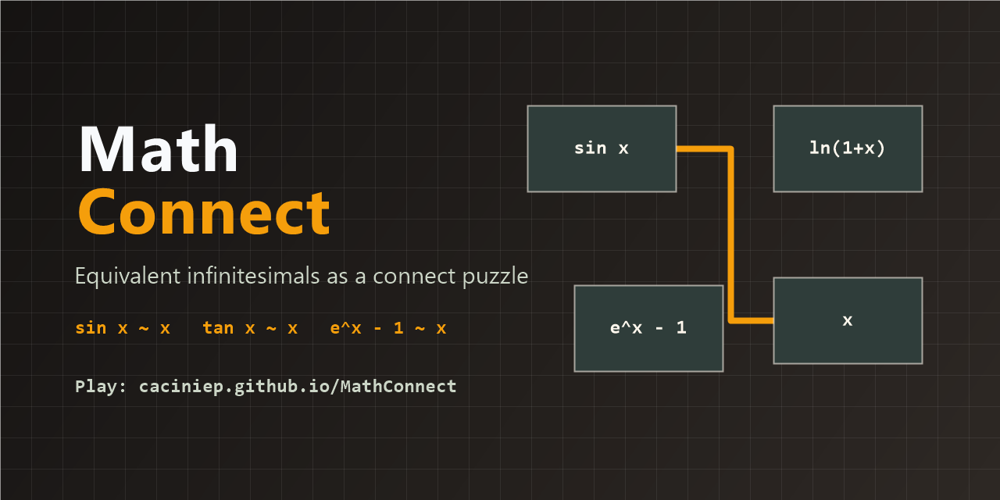

# MathConnect

MathConnect turns equivalent infinitesimals into a fast connect-the-pairs puzzle for calculus practice.

[Play the live game](https://caciniep.github.io/MathConnect/) | [View the source](https://github.com/CacinieP/MathConnect)



## Why This Exists

Equivalent infinitesimals are usually memorized as a list. MathConnect makes that list interactive: clear the board by connecting two formulas that behave the same as `x -> 0`, while following a Lianliankan-style path rule.

The result is a small browser game that helps learners recognize patterns like:

| Family | Matching examples |
| --- | --- |
| `x` | `sin x`, `tan x`, `arcsin x`, `arctan x`, `e^x - 1`, `ln(1+x)` |
| `2x` | `sin(2x)`, `tan(2x)`, `e^{2x} - 1`, `ln(1+2x)` |
| `x^2 / 2` | `1 - cos x` |
| `x^2` | `2(1 - cos x)`, `sin^2 x` |

## How To Play

1. Pick two tiles with equivalent behavior as `x -> 0`.
2. The tiles must connect through empty space with at most two turns.
3. Clear the full board and start another round.

## Current Scope

- Level: equivalent infinitesimals for `x -> 0`
- Board: 6 by 10 on desktop, 8 by 6 on small screens
- Rendering: KaTeX-powered math tiles
- Stack: React, Vite, JavaScript, CSS
- Deployment: GitHub Pages

## Roadmap

- Add timed and relaxed modes
- Add hint and shuffle controls
- Add more calculus levels: limits, derivatives, integrals, and Taylor expansions
- Track streaks, mistakes, and completion time
- Add a bilingual rules panel for classroom use

## Local Development

```bash
npm install
npm run dev
```

Build for production:

```bash
npm run build
```

Run the lightweight game-logic check:

```bash
node testGame.js
```

## License

MIT
